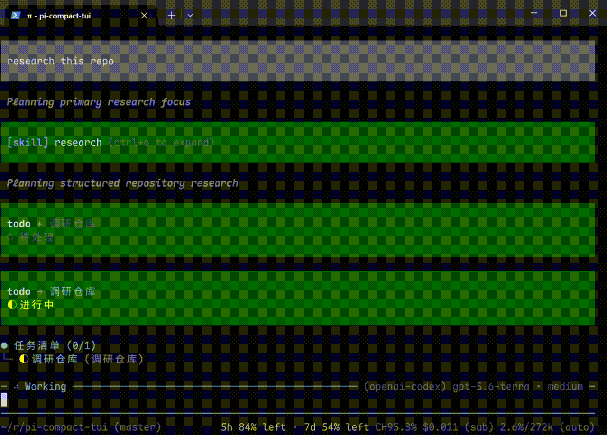
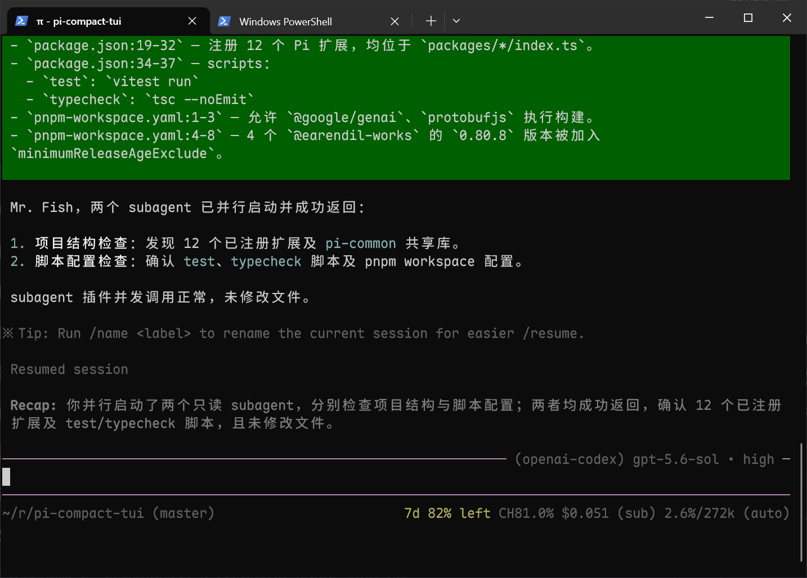

# pi-compact-tui

一组面向日常使用的 [Pi](https://pi.dev/) 扩展：精简 TUI、补充常用状态，并提供输入历史、新会话快捷命令和额外模型 provider。



## 安装

### npm

```bash
pi install npm:pi-compact-tui
```

### Git

```bash
pi install git:github.com/saltfishpr/pi-compact-tui
```

## 你会得到什么

| 功能         | 用途                                                                                                   |
| ------------ | ------------------------------------------------------------------------------------------------------ |
| 紧凑编辑器   | 在输入框边框中显示当前工作状态、模型和推理级别，减少额外界面占用。                                     |
| 多行页脚     | 集中显示项目路径、Git 分支、会话、token、费用、上下文和其他扩展状态。                                  |
| 用量状态     | 使用 OpenAI Codex、DeepSeek 或 Z.ai 时，在页脚查看订阅限流额度或账户余额。                            |
| 输入历史     | 使用 `shift+↑` / `shift+↓` 找回之前提交的输入；记录会跨会话保留。                                      |
| 快速新会话   | 使用 `/clear` 立即开始新会话，效果与 `/new` 相同。                                                     |
| Git 自动信任 | 根据 `origin` 远程地址中的域名或用户名，自动信任符合规则的项目。                                       |
| 子代理       | 注册 `agent` 工具，将聚焦任务委派给在隔离上下文中运行的专用子代理，并在 TUI 中实时展示进度。           |
| 空闲回顾     | 会话进入空闲状态时自动生成会话摘要，并通过 TUI widget 展示；亦可通过 `/recap` 手动触发。               |
| Bash 审计    | 由指定模型评估待执行的 bash 命令：低风险仅提示，中风险以警告展示，高风险或审计失败会要求确认后再执行。 |
| 会话小贴士   | 每次会话开始时，在 TUI 顶部展示一条使用小贴士。                                                        |

## 插件说明

除非对应章节另有说明，安装后即可使用所有内置插件。全局配置文件统一位于 `~/.pi/agent/extensions/`。

### 紧凑编辑器（`pi-compact-editor`）

**使用方法：** 在 TUI 模式下，输入框边框会显示当前模型和推理级别；Agent 工作时还会显示思考、输出和正在运行的工具等状态。

**配置：** 无。

### 紧凑页脚（`pi-compact-footer`）

**使用方法：** 在 TUI 模式下，页脚按配置展示会话、模型、token、费用、上下文、Git 和其他插件状态。

**配置：** 插件会生成 `~/.pi/agent/extensions/footer.json`。编辑后重启 Pi 会话：

```json
{
  "separator": " ",
  "lines": [
    {
      "left": ["pwd", "branch", "sessionName"],
      "right": ["cacheHitRate", "cost", "context"]
    },
    { "left": ["extensionStatuses"] }
  ]
}
```

- `separator` — 各可见元素之间的分隔文本。
- `lines` — 页脚行；每行可包含 `left` 和 `right` 元素数组。
- 内置元素：`pwd`、`branch`、`sessionName`、`inputTokens`、`outputTokens`、`cacheReadTokens`、`cacheWriteTokens`、`cacheHitRate`、`cost`、`context`、`provider`、`model`、`thinkingLevel` 和 `extensionStatuses`。
- 使用 `status:<key>` 可单独放置插件状态，例如 `status:codex-stats`、`status:deepseek-stats` 或 `status:zai-stats`。

### 用量状态（`pi-usage-stats`）

**使用方法：** 插件会为当前选择的 provider 展示状态，并在使用过程中自动刷新：

- `openai-codex`：各订阅限流窗口的剩余百分比。
- `deepseek`：今日用量、当前会话用量和账户余额。
- `zai-coding-cn`：今日用量、当前会话用量和账户余额。

**配置：** 先在 Pi 中配置 provider 凭据。插件会生成 `~/.pi/agent/extensions/provider-stats.json`；默认启用全部已支持的 provider：

```json
{
  "providers": {
    "deepseek": { "currency": "USD" },
    "zai-coding-cn": { "enabled": false }
  }
}
```

`enabled` 默认值为 `true`。DeepSeek 可通过 `currency` 选择 `CNY` 或 `USD`；Z.ai 固定展示 CNY。紧凑页脚需包含 `extensionStatuses`，或对应 provider 的稳定状态 key：`status:codex-stats`、`status:deepseek-stats`、`status:zai-stats`。

### 输入历史（`pi-history`）

**使用方法：** 按 `shift+↑` 找回之前提交的输入，按 `shift+↓` 向后移动或恢复当前草稿。历史记录会跨会话保留。

**配置：** 无。插件会自动管理 `~/.pi/agent/extensions/history.jsonl`。

### 清空命令（`pi-clear-command`）

**使用方法：** 执行 `/clear` 开始一个全新会话，效果与 `/new` 相同。

**配置：** 无。

### Git 自动信任（`pi-trust-git`）

**使用方法：** Pi 检查项目是否可信时，插件会读取 `origin` 远程地址；若域名或首段用户名命中白名单，则自动信任项目，否则继续执行 Pi 默认信任流程。

**配置：** 编辑自动生成的 `~/.pi/agent/extensions/trust.json`：

```json
{
  "domains": ["private-gitlab.com"],
  "usernames": ["saltfishpr", "my-team"]
}
```

匹配不区分大小写，任一列表命中即可。

### 子代理（`pi-subagent`）

**使用方法：** 让 Pi 将聚焦任务委派给 `explore` 以查找代码事实，或委派给 `planner` 以制定实现方案。每个任务运行在独立会话中，最终答案会返回父会话。

```text
使用 planner 子代理检查当前项目，并为添加用户认证制定实现计划。
```

**配置：** 自动生成的 `~/.pi/agent/extensions/subagent.json` 默认启用 `agent` 工具；将 `enabled` 设为 `false` 可关闭。

```json
{
  "enabled": true,
  "maxConcurrent": 4,
  "agents": {
    "explore": {
      "model": "deepseek/deepseek-chat",
      "effort": "medium",
      "maxTurns": 30
    }
  }
}
```

`maxConcurrent` 控制同时运行的子代理数量（1–32）；超出的调用按 FIFO 顺序等待。子代理与父会话共用工作目录，并行编辑任务可能发生冲突。

在 `agents.<名称>` 中可覆盖单个子代理的 `model`、`effort` 或 `maxTurns`，无需修改其 Markdown 定义；未填字段沿用子代理自身的 frontmatter。

如需添加自定义子代理，在 `~/.pi/agent/agents/` 中创建所有项目可用的 Markdown 文件，或在 `.pi/agents/` 中创建仅供当前已信任项目使用的文件。文件名即子代理名称；修改后执行 `/reload`。

```markdown
---
description: 审查代码改动的正确性和可维护性，不修改文件。
tools:
  - read
  - bash
effort: high
---

审查指定改动，引用相关文件并报告明确问题。
```

| 字段          | 必填 | 用途                                                                                      |
| ------------- | ---- | ----------------------------------------------------------------------------------------- |
| `description` | 是   | 告诉 Pi 这个子代理适合处理什么任务。                                                      |
| `tools`       | 否   | 限制可用工具；省略时允许使用所有内置编码工具。                                            |
| `model`       | 否   | 使用 `provider/model` 指定模型；省略时继承当前模型；超出父会话 model scope 时回退父模型。 |
| `effort`      | 否   | 设置推理档位：`off`、`minimal`、`low`、`medium`、`high`、`xhigh` 或 `max`。               |
| `skills`      | 否   | Pi skill 的精确 allow list；省略时不加载 skill。                                          |
| `maxTurns`    | 否   | 限制子代理最多执行多少轮；默认 50。                                                       |

子代理会话不会加载任何扩展（extension）。

项目级定义仅在项目受信任时加载。同名定义的优先级为：项目级、全局、内置。

### 空闲回顾（`pi-recap`）



**使用方法：** Agent 完成工作后，如果会话保持空闲 5 分钟，插件会生成简短摘要。执行 `/recap` 可立即触发。

**配置：** 当前项目使用 `.pi/extensions/recap.json`，全局使用 `~/.pi/agent/extensions/recap.json`；项目配置优先。

```json
{
  "model": "openai/gpt-4o-mini",
  "thinkingLevel": "off",
  "idle": "3m"
}
```

- `model` — 可选，使用 `provider/model` 格式指定专用模型；默认使用当前模型。
- `thinkingLevel` — 可选，可设为 `off`、`minimal`、`low`、`medium`、`high`、`xhigh` 或 `max`。
- `idle` — 可选，可使用 `"3m"` 或 `180000` 等时长，最短 5 秒。

### Bash 审计（`pi-bash-audit`）

**使用方法：** 默认关闭。在 TUI 模式执行 `/audit`，选择模型和推理档位即可启用。插件会直接执行已识别的只读命令，并使用所选模型评估其他命令。高风险命令、模型不可用或审计失败时，均须确认后才会执行。

**配置：** `/audit` 会创建 `~/.pi/agent/extensions/bash-audit.json`。也可手动创建或编辑该文件：

```json
{
  "enable": true,
  "model": "openai/gpt-4o-mini",
  "thinkingLevel": "off",
  "rules": [
    { "command": "git", "args": ["log"], "action": "allow" },
    { "command": "git", "args": ["push"], "action": "prompt" }
  ]
}
```

- `enable` — 可选；设为 `false` 可关闭审计，同时保留配置。
- `model` — 启用审计时必填，格式为 `provider/model`。
- `thinkingLevel` — 可选，使用所选模型支持的推理档位。
- `rules` — 可选的有序覆盖规则，采用第一条匹配的规则。
  - `command` 匹配命令名，`args` 匹配参数。字面量按前缀匹配；`*` 匹配单个参数中的任意内容，`**` 匹配任意数量参数，`/正则/` 对单个参数进行全匹配。
  - `action` 可设为 `allow`（直接执行）、`prompt`（始终确认）或 `auto`（交由审计模型判断）。
  - `except` 可选，用于排除不适用当前规则的参数模式。

### 会话小贴士（`pi-tips`）

**使用方法：** 每次会话开始时，在对话记录顶部展示一条随机使用提示。

**配置：** 默认使用英文。若要选择中文或其他 rpiv 扩展提供的语言，安装共享语言扩展后执行 `/languages`：

```bash
pi install npm:@juicesharp/rpiv-i18n
```

## 更新与卸载

### npm

```bash
pi update npm:pi-compact-tui
pi remove npm:pi-compact-tui
```

### Git

```bash
pi update --extensions
pi remove git:github.com/saltfishpr/pi-compact-tui
```

## License

MIT
