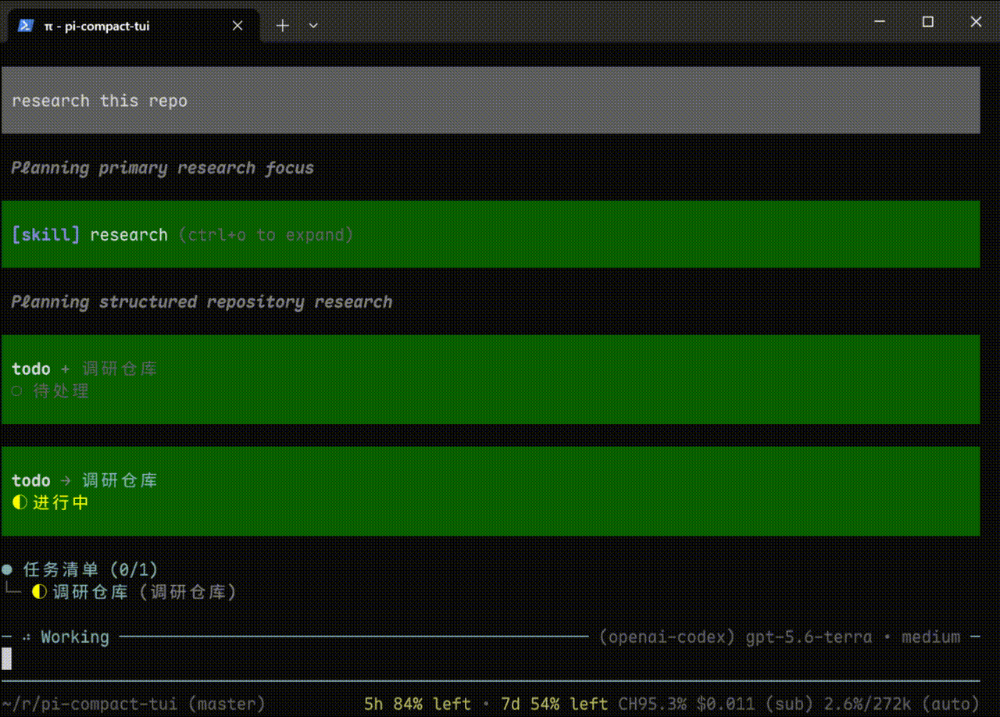
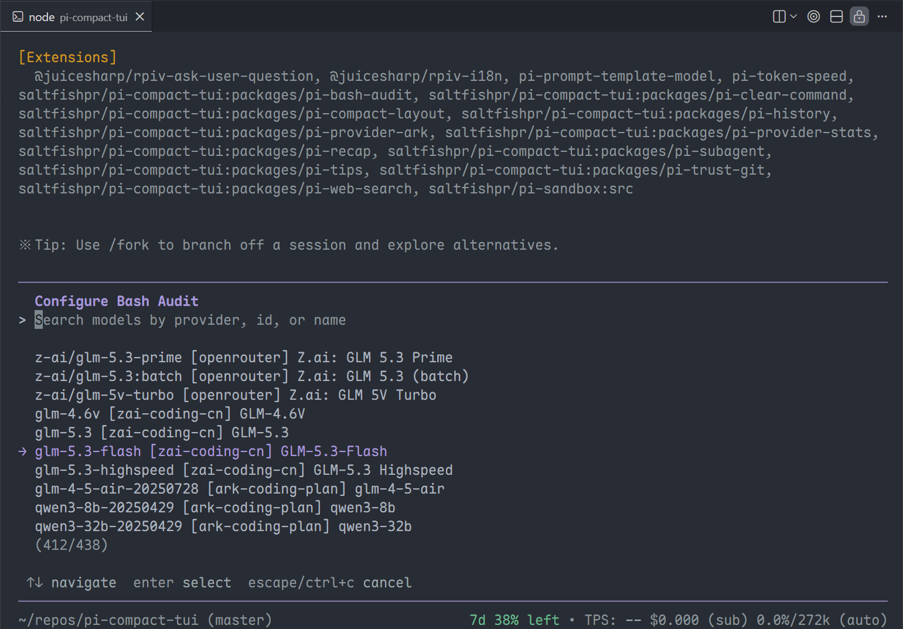
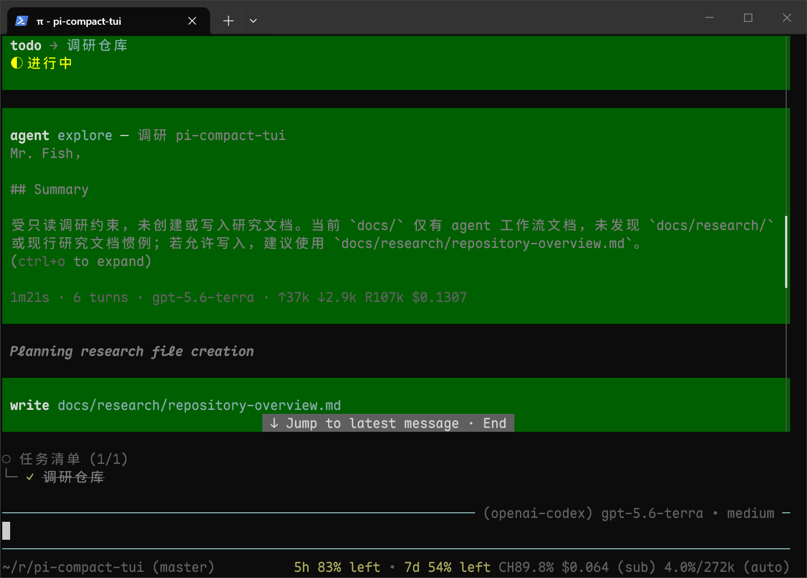

[English](./README.md) ｜ 中文

# pi-compact-tui

一组面向日常使用的 [Pi](https://pi.dev/) 扩展：精简 TUI、补充状态信息，并提供命令审计、输入历史、会话回顾、subagent、联网搜索等能力。



## 安装

```bash
pi install npm:pi-compact-tui
# 或
pi install git:github.com/saltfishpr/pi-compact-tui
```

所有插件的配置文件统一放在 `~/.pi/agent/extensions/` 目录下，首次使用时会自动生成默认配置，无需手动创建。

## 插件

### Bash 命令审计（`pi-bash-audit`）

拦截 Pi 执行的 bash 命令，分两级防护：

1. **规则匹配**：内置一份"只读命令白名单"（如 `ls`、`cat`、`git status` 等），命中的直接放行；也可以用规则强制放行、强制确认或交给模型审计。
2. **模型审计**：规则未放行的命令交给指定模型判断风险，高风险命令弹出确认框，由你决定是否执行。



**配置**：运行 `/audit` 选择审计模型和推理档位即可启用，也可以直接编辑 `~/.pi/agent/extensions/bash-audit.json`：

```json
{
  "enable": true,
  "model": "anthropic/claude-sonnet-4-5",
  "thinkingLevel": "off",
  "timeoutMs": 10000,
  "rules": [
    { "command": "pnpm", "args": ["install"], "action": "allow" },
    { "command": "rm", "args": ["-rf"], "action": "prompt" }
  ]
}
```

字段说明：

- `model`：审计模型，格式 `<provider>/<model-id>`；不填则使用当前会话模型。
- `thinkingLevel`：`off` / `minimal` / `low` / `medium` / `high` / `xhigh` / `max`。
- `timeoutMs`：模型审计超时时间，单位为毫秒，默认为 `10000`。
- `rules`：每条规则包含：
  - `command`：命令名（如 `pnpm`）；
  - `args`：需要匹配的参数（如 `["install"]`）；
  - `except`：例外参数组合，命中后不应用本规则；
  - `action`：`allow`（直接放行）/ `prompt`（人工确认）/ `auto`（交给模型审计）。

### 清屏新会话（`pi-clear-command`）

提供 `/clear` 命令，开启全新会话并继承当前模型和推理档位。

### 精简布局（`pi-compact-layout`）

自定义输入框边框和底部状态栏（footer），把模型、用量、Git 分支等信息放在你需要的位置。支持多行 footer，以及输入框的右上、左下、右下三个位置；Pi 的活动状态嵌入左上边框，保留原生滚动提示、快捷键和边框颜色。

**配置**：编辑 `~/.pi/agent/extensions/compact-layout.json`，运行 `/reload` 生效。默认配置如下：

```json
{
  "separator": " ",
  "footer": [
    {
      "left": [
        "pwd",
        { "kind": "element", "value": "branch", "prefix": "(", "suffix": ")" },
        "sessionName"
      ],
      "right": [
        "status:codex-stats",
        "status:deepseek-stats",
        "status:zai-stats",
        "cacheHitRate",
        "cost",
        "context"
      ]
    },
    { "left": ["extensionStatuses"], "right": [] }
  ],
  "editor": {
    "topRight": [
      { "kind": "element", "value": "provider", "prefix": "(", "suffix": ")" },
      "model",
      { "kind": "element", "value": "thinkingLevel", "prefix": "• ", "suffix": "" }
    ],
    "bottomLeft": [],
    "bottomRight": []
  }
}
```

**布局字段**：

- `footer`：每个对象对应一行，`left` 和 `right` 数组分别靠左、靠右显示。设为 `[]` 隐藏 footer，没有内容的行自动隐藏。
- `editor`：`topRight`、`bottomLeft`、`bottomRight` 分别对应输入框右上、左下、右下。设为 `{}` 清空这三个位置，但不影响 Pi 的活动状态和滚动提示。
- `separator`：同一数组中非空元素之间的分隔文本，默认为一个空格。

数组顺序就是显示顺序，元素不自带圆点分隔符或装饰括号。可以在任意位置使用下表中的元素；移动元素即可更换位置，删除元素即可隐藏，重复添加则重复显示。省略整个 `footer` 或 `editor` 字段时保留该部分默认布局；提供字段时替换整个布局，不与默认值合并，未填写的 `left`、`right` 或边框位置为空。空间不足时，内容会截断或隐藏；Pi 的活动状态和滚动提示优先显示。

**可用元素**：

| 元素                                  | 显示内容                                                                            |
| ------------------------------------- | ----------------------------------------------------------------------------------- |
| `pwd`、`branch`、`sessionName`        | 当前会话目录、Git 分支、会话名                                                      |
| `provider`、`model`、`thinkingLevel`  | 当前 provider、模型、推理档位（如 `high` 或 `off`）；推理档位仅对支持推理的模型显示 |
| `inputTokens`、`outputTokens`         | 会话累计输入、输出 token 数                                                         |
| `cacheReadTokens`、`cacheWriteTokens` | 会话累计缓存读取、写入 token 数                                                     |
| `cacheHitRate`                        | 最近一次模型响应的输入缓存命中率                                                    |
| `cost`                                | 会话累计费用，订阅模型带有 `(sub)` 标记                                             |
| `context`                             | 上下文占用比例和窗口大小，启用自动压缩时带有 `(auto)` 标记                          |
| `extensionStatuses`                   | 未单独指定位置的其他扩展状态                                                        |
| `status:<key>`                        | 指定扩展状态，例如 `status:codex-stats`；需要提供该状态的扩展已启用                 |

例如，将 `status:codex-stats` 从 footer 移到 `editor.bottomRight`，即可在输入框右下显示 Codex 用量。单独指定位置的状态不会再出现在 `extensionStatuses` 中，扩展提供的颜色保持不变。订阅用量和账户余额由本包的 `pi-usage-stats` 提供，没有对应状态时不显示。

需要装饰元素时，使用 `{ "kind": "element", "value": "branch", "prefix": "(", "suffix": ")" }`。`value` 可以使用上表中的任意元素，包括 `status:<key>`。`prefix`、`suffix` 均可省略，默认为空字符串，仅在元素有内容时显示。默认布局通过这种配置显示 `(branch)`、`(provider)` 和 `model • thinkingLevel`；直接使用字符串元素时不带装饰。

数组中也可以加入 `{ "kind": "literal", "value": "|" }` 显示自定义单行文本。`color` 是可选项，使用时填写 Pi 主题的前景色名称，例如 `dim`、`accent`、`warning`；未填写或名称无效时按 `dim` 显示。

### 输入历史（`pi-history`）

按 `Shift+↑` / `Shift+↓` 在输入框中翻阅历史输入，跨会话持久保存（保留最近 100 条）。

### 会话回顾（`pi-recap`）

会话空闲时在输入框上方自动生成一句简短的回顾（当前在做什么、下一步是什么），开始新输入或恢复工作后自动清除；也可以随时运行 `/recap` 手动生成。

**配置**：编辑 `~/.pi/agent/extensions/recap.json`：

```json
{
  "model": "anthropic/claude-sonnet-4-5",
  "thinkingLevel": "off",
  "idle": "30s"
}
```

- `model` / `thinkingLevel`：生成回顾用的模型与推理档位，不填则使用当前会话模型。
- `idle`：空闲多久后触发回顾，支持数字（毫秒）或 `"30s"`、`"1m"` 等时长字符串，最小 5 秒。


### Subagent（`pi-subagent`）

为 Pi 提供 `agent` 工具，可把独立子任务委托给在隔离上下文中运行的子代理。内置 `explore`（探索）、`planner`（规划）和 `reviewer`（代码审查），你也可以添加自己的。



**添加子代理**：在 `~/.pi/agents/`（全局）或 `.pi/agents/`（项目）下放置 Markdown 文件，文件名即子代理名：

```markdown
---
description: 审查代码变更，输出问题清单
model: anthropic/claude-sonnet-4-5
effort: low
maxTurns: 30
---

!git status --short

这里写子代理的系统提示词……
```

- `description`（必填）：告诉主模型何时使用该子代理。
- `model` / `effort` / `maxTurns`：可选，不填时继承当前会话模型；`maxTurns` 默认 50。
- `!command`：可选，写在代码块外、行首的 shell 命令。子代理启动前在当前项目目录执行，输出会提供给子代理。

**配置**：编辑 `~/.pi/agent/extensions/subagent.json`，可关闭功能、限制并发数，或按子代理名覆盖其 `model` / `effort` / `maxTurns`：

```json
{
  "enabled": true,
  "maxConcurrent": 4,
  "agents": {
    "explore": { "effort": "low" }
  }
}
```

**命令授权**：执行配置中的 `!` 命令前，可选择拒绝、仅本次允许或信任此版本。在 TUI 中运行 `/subagent-trust` 可搜索可用配置，用 Enter/Space 切换信任、Ctrl+A 全选、Ctrl+X 清空，最后用 Ctrl+S 一次保存全部修改，或用 Esc 放弃修改。命令自动维护 `subagent.json` 中的 `trustedProfiles`；信任绑定文件路径和内容哈希，适用于所有工作目录，文件变化后需要重新授权。当前列表未显示的其他项目配置不受影响。此授权仅针对 `!` 命令，不限制子代理后续使用工具。

### 使用提示（`pi-tips`）

每次新开会话时在顶部展示一条随机使用技巧（如快捷键、常用命令），支持多语言。

### Git 自动信任（`pi-trust-git`）

根据项目 Git `origin` 远程地址自动信任项目，跳过 Pi 的手动确认。

**配置**：编辑 `~/.pi/agent/extensions/trust.json`，命中任一名单即自动信任：

```json
{
  "domains": ["github.com"],
  "usernames": ["saltfishpr"]
}
```

- `domains`：信任的远程域名（如 `github.com`、`gitlab.com`）。
- `usernames`：信任的远程路径首段（如 `github.com/saltfishpr/xxx` 中的 `saltfishpr`）。

### 用量状态（`pi-usage-stats`）

在状态栏展示当前模型的 provider 用量：

- **openai-codex**：订阅限流窗口（5h / 7d 剩余额度和相对重置时间）。
- **deepseek**：账户余额。
- **zai-coding-cn**（智谱）：账户余额。

**配置**：编辑 `~/.pi/agent/extensions/provider-stats.json`，按需关闭某个 provider、隐藏订阅重置时间或指定余额币种：

```json
{
  "providers": {
    "openai-codex": { "showResetTime": false },
    "deepseek": { "enabled": true, "currency": "CNY" }
  }
}
```

未配置的 provider 默认启用，订阅重置时间默认展示。

### 联网搜索（`pi-web-search`）

提供 `web_search` 工具，用于查询需要时效性或外部验证的信息。结果包含标题、URL 和摘要，方便引用来源。注册 search provider 后，工具自动启用。

**配置**：在 `~/.pi/agent/extensions/web-search.json` 中用 `provider` 指定默认 provider ID；`maxResults` 指定默认返回数量，范围 1～10，默认为 5。调用 `web_search` 时可覆盖这两个值；未配置默认 provider 时，调用必须指定 `provider`。

接入其他搜索服务的方法见[自定义 provider 开发指南](packages/pi-web-search/docs/PROVIDERS.zh.md)。

#### BigModel

内置 BigModel 联网搜索 provider。要启用它，在 `~/.pi/agent/extensions/web-search.json` 中填写 API Key：

```json
{
  "provider": "bigmodel",
  "maxResults": 5,
  "providers": {
    "bigmodel": {
      "apiKey": "your-api-key",
      "searchEngine": "search_std"
    }
  }
}
```

`searchEngine` 可选 `search_std`（默认）、`search_pro`、`search_pro_sogou` 或 `search_pro_quark`。

**从 Brave 或 Tavily 迁移**：内置的 Brave、Tavily provider 已移除。原有的 `provider: "brave"` 或 `provider: "tavily"` 配置不会启用搜索。请改用 BigModel，或按上面的开发指南注册自定义 provider。

## License

MIT
